<center>

## Árboles binarios

</center>

<p align="justify">Un <strong>árbol binario</strong> es un árbol cuyos nodos no pueden tener más de dos subárboles. En un árbol binario, cada nodo puede tener cero, uno o dos hijos (subárboles). Se conoce el nodo de la izquierda como <i>hijo izquierdo</i> y el nodo de la derecha como <i>hijo derecho.</i></p>

<p align="center">
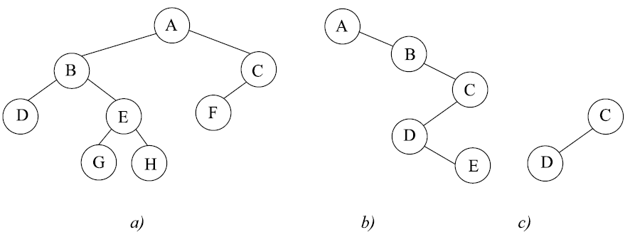
<p align="center"><i>Ejemplos de árboles binarios</i></p>
</p>

---

<i>Nota:</i>

<p align="justify">Un árbol binario no puede tener más de dos subárboles.</p>

---

<p align="justify">Un árbol binario es una estructura recursiva. Cada nodo es la raíz de su propio subárbol y tiene hijos, que son raíces de árboles, llamados subárboles derecho e izquierdo del nodo, respectivamente. Un árbol binario se divide en tres subconjuntos disjuntos.</p>

<p align="justify"><i>{R}</i> Nodo raíz</p>
<p align="justify"><i>{I1,I2, ...In}</i> Subárbol izquierdo de <i>R</i></p>
<p align="justify"><i>{D1,D2, ...Dn}</i> Subárbol derecho de <i>R</i></p>

<p align="center">
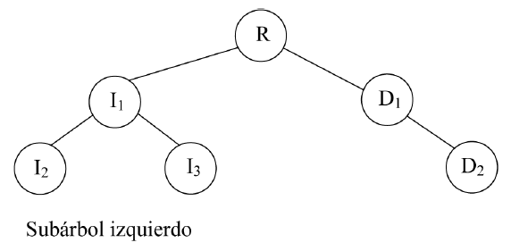
<p align="center"><i>Árbol binario con subárbol izquierdo</i></p>
</p>

<p align="justify">En cualquier nivel un árbol binario puede contener de <i>1</i> a <i>2<sup>n</sup></i> nodos. El número de nodos por nivel contribuye a la densidad del árbol.</p>

### Equilibro

<p align="justify">La distancia de un nodo a la raíz determina la eficiencia con la que puede ser localizado. Por ejemplo, dado cualquier nodo de un árbol, a sus hijos se puede acceder siguiendo sólo un camino de bifurcación o de ramas, el que conduce al nodo deseado. De modo similar, a los nodos en el nivel 2 de un árbol sólo puede accederse siguiendo dos ramas del árbol.</p>

<p align="justify">La característica anterior nos conduce a una característica muy importante de un árbol binario, su <strong>balance</strong> o <strong>equilibrio</strong> de un árbol binario es la diferencia en altura entre los subárboles derecho e izquierdo. Si la altura del subárbol izquierdo es <i>h<sub>I</sub></i> y la altura del subárbol derecho <i>h<sub>D</sub></i>, entonces el <strong>factor de equilibrio</strong> del árbol <i>B</i> se determina por la siguiente fórmula:</p>

<p align="center"><i>B = h<sub>D</sub> - h<sub>I</sub></i></p>

<p align="justify">Un árbol está <strong>perfectamente equilibrado</strong> si su equilibrio o balance es <i>cero</i> y sus subárboles son también perfectamente equilibrados. Dado que esta definición ocurre raramente se aplica
una definición alternativa: un árbol binario está equilibrado si la altura de sus subárboles difiere
en no más de uno y sus subárboles son también equilibrados; por consiguiente, el factor de
equilibrio de cada nodo puede tomar los valores -1, 0, +1.</p>

### Árboles binarios completos

<p align="justify">Un árbol binario <strong>completo</strong> de profundidad n es un árbol en el que para cada nivel, del 0 al nivel
n-1, tiene un conjunto lleno de nodos, y todos los nodos hoja a nivel n ocupan las posiciones más
a la izquierda del árbol.</p>

<p align="justify">Un árbol binario completo que contiene <i>2<sup>n</sup></i> nodos a nivel <i>n</i> es un <strong>árbol lleno.</strong> Un árbol lleno es un árbol binario que tiene el máximo número de entradas para su altura. Esto sucede cuando el último nivel está lleno.</p>

<p align="center">
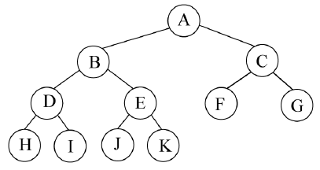
<p align="center"><i>Árbol completo (Profundidad 4)</i></p>
</p>

<p align="center">
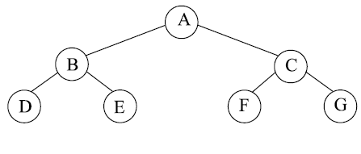
<p align="center"><i>Árbol lleno (Profundidad 3)</i></p>
</p>

<p align="center">
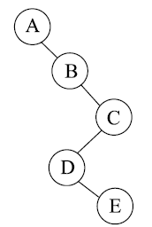
<p align="center"><i>Árbol degenerado (Profundidad 5)</i></p>
</p>

<p align="justify">La última imagen de árbol es un tipo especial, denominado <strong>árbol degenerado</strong>, en el que hay un solo nodo hoja (E) y cada nodo no hoja solo tiene un hijo. Un árbol degenerado es equivalente a una lista enlazada.</p>

### TAD Árbol binario

<p align="justify">La estructura de árbol binario constituye un tipo <i>abstracto de datos;</i> las operaciones básicas que
definen el <i>TAD árbol binario</i> son las siguientes:</p>

<table>
    <tbody>
        <tr>
            <td><strong>Tipo de dato</strong></td>
            <td>Dato que se almacena en los nodos del árbol</td>
        </tr>
        <tr>
            <td><strong>Operaciones</strong></td>
            <td>----------------------------</td>
        </tr>
        <tr>
            <td><i>Crear Arbol</i></td>
            <td>Inicia el árbol como vacío.</td>
        </tr>
        <tr>
            <td><i>Construir</i></td>
            <td>Crea un árbol con un elemento raíz y dos ramas, izquierda y derecha que son a su vez árboles.</td>
        </tr>
        <tr>
            <td><i>EsVacio</i></td>
            <td>Comprueba si el árbol no tiene nodos.</td>
        </tr>
        <tr>
            <td><i>Raiz</i></td>
            <td>Devuelve el nodo raíz</td>
        </tr>
        <tr>
            <td><i>Izquierdo</i></td>
            <td>Obtiene la rama o subárbol izquierda de un árbol dado.</td>
        </tr>
        <tr>
            <td><i>Derecho</i></td>
            <td>Obtiene la rama o subárbol derecho de un árbol dado.</td>
        </tr>
        <tr>
            <td><i>Borrar</i></td>
            <td>Elimina del árbol el nodo con un elemento determinado.</td>
        </tr>
        <tr>
            <td><i>Pertenece</i></td>
            <td>Determina si un elemento se encuetra en el árbol</td>
        </tr>
    </tbody>
</table>

### Operaciones en árboles binarios

<p align="justify">Algunas de las operaciones típicas que se realizan en árboles binarios son las siguientes:</p>

<ul>
    <li>Determinar su altura</li>
    <li>Determinar su número de elementos</li>
    <li>Hacer una copia</li>
    <li>Visualizar el árbol binario en pantalla o en impresora</li>
    <li>Determinar si dos árboles binarios son idénticos</li>
    <li>Borrar (eliminar el árbol)</li>
    <li>Si es un árbol de expresión, evaluar la expresión.</li>
</ul>

<p align="justify">Todas estas operaciones se pueden realizar recorriendo el árbol binario de un modo sistemático. El recorrido es la operación de visita al árbol o, lo que es lo mismo, la visita a cada nodo del árbol una vez y sólo una. La visita de un árbol es necesaria en muchas ocasiones; por ejemplo, si se desea imprimir la información contenida en cada nodo. Existen diferentes formas de visitar o recorrer un árbol que se estudiarán más adelante.</p>

## ESTRUCTURA DE UN ÁRBOL BINARIO

<p align="justify">Un árbol binario se construye con nodos. Cada nodo debe contener el campo <i>dato</i> (datos a almacenar)
y dos campos de enlace <i>(apuntador)</i>, uno al subárbol izquierdo <strong>(izquierdo, izdo)</strong> y otro al subárbol derecho <strong>(derecho, dcho)</strong>. El valor <i>null</i> indica un árbol o un subárbol vacío.</p>

<p align="center">
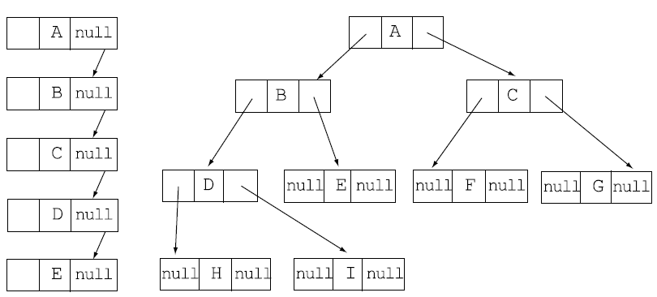
<p align="center"><i>La representación enlazada de dos árboles binarios de raíz A. El primero
es un árbol degenerado a la izquierda; el segundo es un árbol binario completo de profundidad 4.</i></p>
</p>

<p align="justify">Se puede observar que los nodos de un árbol binario que son hojas se caracterizan por tener sus dos campos de enlace a null.</p>

### **Representación de un nodo**

<p align="justify">La clase <i>Nodo</i> agrupa a todos los campos de que consta: <i>dato, izdo</i> (rama izquierda) y <i>dcho</i> (rama derecha). Además, dispone de dos constructores; el primero inicializa el campo <i>dato</i> a un valor y los enlaces a <i>null</i>, en definitiva, se inicializa como hoja y el segundo inicializa <i>dato</i> a un valor y las ramas a dos subárboles.</p>

<p align="center">
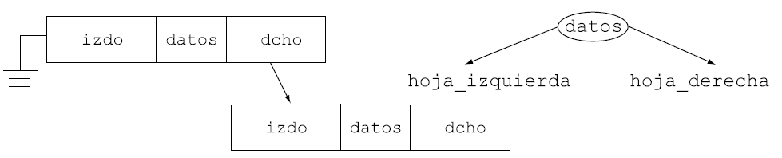
<p align="center"><i>Representación gráfica de los campos de un nodo</i></p>
</p>

```java
package arbolBinario;
public class Nodo {
    protected Object dato;
    protected Nodo izdo;
    protected Nodo dcho;

    public Nodo(Object valor) {
        dato = valor;
        izdo = dcho = null;
    }

    public Nodo(Nodo ramaIzdo, Object valor, Nodo ramaDcho) {
        this(dato);
        izdo = ramaIzdo;
        dcho = ramaDcho;
    }

    // operaciones de acceso
    public Object valorNodo(){ return valor; }
    public Nodo subarbolIzdo(){ return izdo; }
    public Nodo subarbolDcho(){ return dcho; }
    public void nuevoValor(Object d){ dato = d; }
    public void ramaIzdo(Nodo n){ izdo = n; }
    public void ramaDcho(Nodo n){ dcho = n; }
}
``` 

### **Creación de un árbol binario**

<p align="justify">A partir del nodo raíz de un árbol se puede acceder a los demás nodos del árbol, por ello se mantiene la referencia a la raíz del árbol. Las ramas izquierda y derecha son, a su vez, árboles binarios que tienen su raíz, y así recursivamente hasta llegar a las hojas del árbol. La clase <i>ArbolBinario</i> tiene el campo <i>raiz</i>, un constructor que inicializa <i>raiz</i> y métodos para implementar las operaciones.</p>

```java
package arbolBinario;
    public class ArbolBinario {
        protected Nodo raiz;
        
        public ArbolBinario(){
            raiz = null;
        }

        public ArbolBinario(Nodo raiz) {
            this.raiz = raiz;
        }

        public Nodo raizArbol() {
            return raiz;
        }

        // Comprueba el estatus del árbol
        boolean esVacio() {
            return raiz == null;
        }
        // ...
``` 

<br />
<p align="justify">El método <i>nuevoArbol</i>() crea un árbol de raíz un nodo con el campo dato, rama izquierda y derecha pasadas en los argumentos.</p>

```java
public static Nodo nuevoArbol(Nodo ramaIzqda, Object dato, Nodo ramaDrcha) {
    return new Nodo(ramaIzqda, dato, ramaDrcha);
}
```

<p align="justify">Se utiliza un esquema secuencial y con una <i>Pila</i> que guarda. en cada paso, los subárboles.</p>

```java
import TipoPila.PilaVector;

ArbolBinario arbol;
Nodo a1, a2, a;
PilaVector pila = new PilaVector();
a1 = ArbolBinario.nuevoArbol(null,"Maria",null);
a2 = ArbolBinario.nuevoArbol(null,"Rodrigo",null);
a = ArbolBinario.nuevoArbol(a1,"Esperanza",a2);
pila.insertar(a);
a1 = ArbolBinario.nuevoArbol(null,"Anyora",null);
a2 = ArbolBinario.nuevoArbol(null,"Abel",null);
a = ArbolBinario.nuevoArbol(a1,"M Jesus",a2);
pila.insertar(a);
a2 = (Nodo) pila.quitar();
a1 = (Nodo) pila.quitar();
a = ArbolBinario.nuevoArbol(a1,"Esperanza",a2);
arbol = new ArbolBinario(a);
```

<br />
<p align="center">
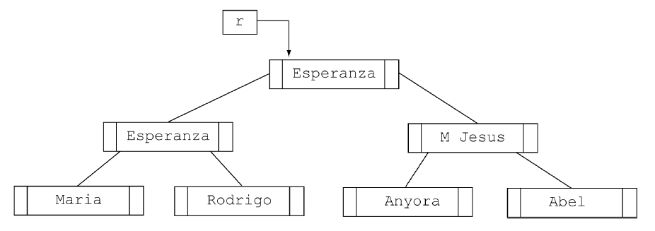
<p align="center"><i>Árbol binario de cadenas</i></p>
</p>

## **ÁRBOL DE EXPRESIÓN**

<p align="justify">Una aplicación muy importante de los árboles binarios son los <i>árboles de expresiones</i>. Una <strong>expresión</strong> es una secuencia de <i>tokens</i> (componentes de léxicos que siguen unas reglas establecidas). Un <i>tokens</i> puede ser operando o bien un operador.</p>


<p align="center">
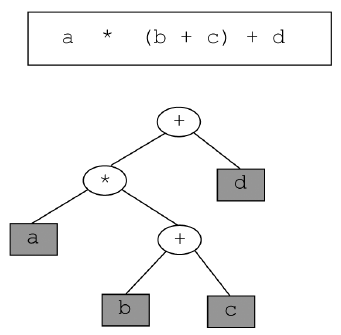
<p align="center"><i>Una expresión infija y su árbol de expresión</i></p>
</p>

<p align="justify">Representa la expresión <i>infija a * (b + c) + d</i> junto a su árbol de expresión. El nombre de <i>infija</i> es debido a que los operadores se sitúan entre los operandos. Un <strong>árbol de expresión</strong> es un árbol binario con las siguientes propiedades:</p>

<ol>
    <li>Cada hoja es un operando</li>
    <li>Los nodos raíz y los nodos internos son operadores.</li>
    <li>Los subárboles son subexpresiones cuyo nodo raíz es un operador.</li>
</ol>

<p align="justify">Los árboles binarios se utilizan para representar expresiones en memoria, esencialmente en
compiladores de lenguajes de programación. Se observa que los paréntesis de la expresión no
aparecen en el árbol, pero están implicados en su forma, y esto resulta muy interesante para la
evaluación de la expresión.</p>

## **Recorrido de un árbol**

<p align="justify">Para visualizar o consultar los datos almacenados en un árbol se necesita <i>recorrer</i> el árbol o <i>visitar</i> los nodos del mismo. Al contrario que las listas enlazadas, los árboles binarios no tienen realmente un primer valor, un segundo valor, un tercer valor, etc. Se puede afirmar que el nodo raíz viene el primero, pero, ¿quién viene a continuación? Existen diferentes métodos de recorrido de árbol ya que la mayoría de las aplicaciones con árboles son bastante sensibles al orden en el que se visitan los nodos, de forma que será preciso elegir cuidadosamente el tipo de recorrido.</p>

<p align="justify">El <strong>recorrido de un árbol binario</strong> requiere que cada nodo del árbol sea procesado (visitado) una vez, y sólo una, en una secuencia predeterminada. Existen dos enfoques generales para la secuencia de recorrido, <i>profundidad y anchura.</i></p>


<p align="justify"><strong>Recorrido en profundidad: </strong>El proceso exige un camino desde la raíz a través de un hijo, al descendiente más lejano del primer hijo antes de proseguir a un segundo hijo. En otras palabras, en el recorrido en profundidad, todos los descendientes de un hijo se procesan antes
del siguiente hijo.</p>

<p align="justify"><strong>Recorrido en anchura: </strong>El proceso se realiza horizontalmente desde el raíz a todos sus hijos; a continuación, a los hijos de sus hijos y así sucesivamente hasta que todos los nodos han sido procesados. En el recorrido en anchura, cada nivel se procesa totalmente antes de que comience el siguiente nivel.</p>

---

**Definición**

El **recorrido** de un árbol supone visitar cada nodo sólo una vez.

---

<p align="justify">Dado un árbol binario que consta de raíz, un subárbol izquierdo y un subárbol derecho, se pueden definir <strong>tres</strong> tipos de secuencia de recorrido en profundidad. Estos recorridos estándar se muestran a continuación:</p>

<p align="center">
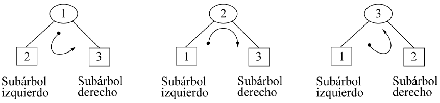
<p align="center">Recorridos de árboles binarios</p>
</p>

<p align="justify">La designación tradicional de los recorridos utiliza un nombre para el nodo raíz <i>(N)</i>, para el subárbol izquierdo <i>(I)</i> y para el subárbol derecho <i>(D)</i>.</p>

## Recorrido Pre-orden

<p align="justify">El recorrido <i>preorden</i>(El nombre preorden, viene del prefijo latino pre que significa “ir antes”.) <strong>(NID)</strong> conlleva los siguientes pasos, en los que el nodo raíz va antes que los subárboles:</p>

<ol>
    <li>Visitar el nodo raíz<strong>(N)</strong></li>
    <li>Recorrer el subárbol izquierdo <strong>(I)</strong> en <i>preorden</i></li>
    <li>Recorrer el subárbol derecho <strong>(I)</strong> en <i>preorden</i></li>
</ol>

<p align="justify">Dadas las características recursivas de los árboles, el algoritmo de recorrido tiene naturaleza recursiva. Primero se procesa la raíz; a continuación, el subárbol izquierdo y, posteriormente, el subárbol derecho. Para procesar el <strong>subárbol izquierdo</strong>, se siguen los mismos pasos:</p>

<strong>Raíz, subárbol izquierdo y subárbol derecho (proceso recursivo). Luego se hace lo mismo con el subárbol derecho.</strong>

---

**:straight_ruler: Regla**

En el recorrido preorden, la raíz se procesa antes que los subárboles izquierdo y derecho.

---

<p align="justify">Si utilizamos el recorrido preorden del árbol: </p>

<p align="center">
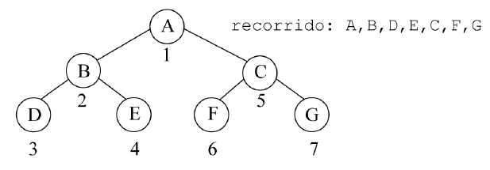
<p align="center">Recorrido preorden de un árbol binario</p>
</p>

<p align="justify">Se visita primero la raíz (nodo <i>A</i>); a continuación, se visita el subárbol izquierdo de <i>A</i>, que consta de los nodos <i>B</i>, <i>D</i> y <i> E. </i> Dado que el subárbol es a su vez un árbol, se visitan los nodos utilizando el mismo orden <i>(NID)</i>. Por
consiguiente, se visita primero el nodo <i>B</i>, después <i>D</i> (izquierdo) y por último <i>E</i> (derecho).</p>

<p align="justify">A continuación se visita el subárbol derecho de <i>A</i>, que es un árbol que contiene los nodos <i>C</i>, <i>F</i> y <i>G</i>. De nuevo, siguiendo el mismo orden <i>(NID)</i>, se visita primero el nodo <i>C</i>, a continuación <i>F</i> (izquierdo) y, por último, <i>G</i> (derecho). En consecuencia, el orden del recorrido <i>preorden</i> para el árbol es <i>A-B-D-E-C-F-G.</i></p>

## Recorrido En Orden

<p align="justify">El recorrido <i>en orden (inorder)</i> procesa primero el subárbol izquierdo, después la raíz y, a continuación, el subárbol derecho. El significado de <i>in</i> es que la raíz se procesa entre los subárboles. Si el árbol no está vacío, el método implica los siguientes pasos:</p>

<ol>
    <li>Recorrer el subárbol izquierdo <strong>(I)</strong> en orden.</li>
    <li>Visitar el nodo raíz <strong>(N).</strong></li>
    <li>Recorrer el subárbol derecho <strong>(D)</strong> en orden.</li>
</ol>

<p align="justify">En el siguiente árbol:</p>

<p align="center">
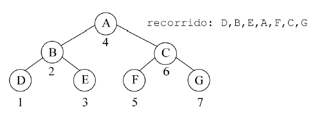
<p align="center">Recorrido enorden de un árbol binario</p>
</p>

<p align="justify">Los nodos se han numerado en el orden en que son visitados durante el recorrido <i>en orden</i>. El primer subárbol recorrido es el subárbol izquierdo del nodo raíz (árbol cuyo nodo contiene la letra <i>B</i>). Este subárbol es, a su vez, otro árbol con el nodo <i>B</i> como raíz, por lo que siguiendo el orden <i>(IND)</i>, se visita primero <i>D</i>, a continuación <i>B</i> (nodo raíz) y, por último, <i>E</i> (derecha). Después, se visita el nodo raíz, <i>A</i>. Por último, se visita el subárbol derecho de <i>A</i>, siguiendo el orden <i>(IND)</i>, se visita primero <i>F</i>, después <i>C</i> (nodo raíz) y por último <i>G</i>. Por consiguiente, el orden del recorrido en orden del árbol es: <i>D-B-E-A-F-C-G.</i></p>

## Recorrido En PostOrden

<p align="justify">El recorrido postorden <strong>(IDN)</strong> procesa el nodo raíz (post) después de que los subárboles izquierdo y derecho se hayan procesado. Comienza situándose en la hoja más a la izquierda y se procesa. A continuación, se procesa su subárbol derecho. Por último, se procesa el nodo raíz. Las etapas del algoritmo, si el árbol no está vacío, son: </p>

<ol>
    <li>Recorrer el subárbol izquierdo <strong>(I)</strong> en <i>postorden.</i></li>
    <li>Recorrer el subárbol derecho <strong>(D)</strong> en <i>postorden.</li>
    <li>Visitar el nodo raíz <strong>(N)</strong></li>
</ol>

<p align="justify">Si se utiliza el recorrido postorden del siguiente árbol: </p>

<p align="center">
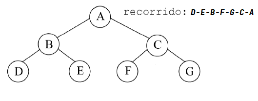
<p align="center">Recorrido enorden de un árbol binario</p>
</p>

<p align="justify">Se visita primero el subárbol
izquierdo de <i>A</i>. Este subárbol consta de los nodos <i>B</i>, <i>D</i> y <i>E</i>, siguiendo el orden <i>IDN</i>, se visitará primero <i>D</i> (izquierdo), luego <i>E</i> (derecho) y, por último, <i>B</i> (nodo). A continuación, se visita el subárbol derecho de <i>A</i> que consta de los nodos <i>C</i>, <i>F</i> y <i>G</i>. Siguiendo el orden <i>IDN</i> para este árbol, se visita primero <i>F</i> (izquierdo), después <i>G</i> (derecho) y, por último, <i>C</i> (nodo). Finalmente se visita el nodo raíz, <i>A</i>. Resumiendo, el orden del recorrido <i>postorden</i> del árbol es: <i>D-E-B-F-G-C-A.</i></p>

<!-- ```java
``` -->

<!--  -->
<br />
<i></i>
<strong></strong>

<p align="justify"></p>
<p align="center"></p>
<!-- <ul>
    <li></li>
</ul> -->