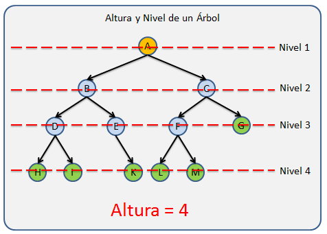
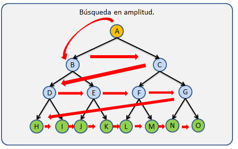

## Árboles

Los árboles son las estructuras de datos más utilizadas, pero también una de las más complejas. Los árboles se caracterizan por almacenar sus nodos en forma jerárquica y no en forma lineal como las <i>Listas ligadas, Colas, pilas, etc</i>, de las cuales ya hemos hablado en días pasados.

<i>La imagen muestra la diferencia entre las estructuras de datos lineales y no lineales como lo son los árboles.</i>

### **Datos importantes de los árboles**

Para comprender de mejor manera que es un árbol comenzaremos explicando como está estructurado.

<ul>
    <li>
<strong>Nodos:</strong> Se le llama Nodo a cada elemento que contiene un árbol.
</li>
    <li>
<strong>Nodo Raíz:</strong> Se refiere al primer nodo de un árbol, solo un nodo del árbol puede ser la raíz.
</li>
    <li>
<strong>Nodo Padre:</strong> Se utiliza este término para llamar a todos aquellos nodos que tienen al menos un hijo.
</li>
    <li>
<strong>Nodos hijo:</strong> Los hijos son todos aquellos nodos que tiene un padre.
</li>
    <li>
<strong>Nodo Hermano: </strong> Los nodos hermanos son aquellos nodos que comparte a un mismo padre en común dentro de la estructura.
</li>
    <li>
<strong>Nodo Hoja: </strong> Son todos aquellos nodos que no tienen hijos, los cuales siempre se encuentran en los extremos de la estructura.
</li>
    <li>
<strong>Nodo Rama: </strong> Estos son todos aquellos nodos que no son la raíz y que además tiene al menos un hijo.
</li>
</ul>

<i>La imagen muestra de forma gráfica cuales son los nodos raíz, rama y hoja.</i>

<i>La imagen muestra de forma gráfica los nodos Padre, Hijo, y Hermanos.</i>

Los árboles además de los nodos tienen otras propiedades importantes que son utilizadas en diferentes ámbitos los cuales son:

<ul>
    <li>
<strong>Nivel:</strong> Nos referimos como nivel a cada generación dentro del árbol. Por ejemplo, cuando a un nodo hoja le agregamos un hijo, el nodo hoja pasa a ser un nodo rama pero además el árbol crece una generación por lo que el árbol tiene un nivel más. Cada generación tiene un número de nivel distinto que las demás generaciones.

    <ul>
    <li>Un árbol vacío tiene 0 niveles</li>
    <li>El nivel de la Raíz es 1.</li>
    <li>
El nivel de cada nodo se calculado contando cuantos nodos existen sobre él, hasta llegar a la raíz + 1, y de forma inversa tambíen se podría, contar cuantos nodos existen desde la raíz hasta el nodo buscado + 1.
</li>
    </ul>
    </li>
     
    <li>
<strong>Altura: </strong> Le llamamos Altura al número máximo de niveles de un árbol.

          
        

            
        

        
<i>En la imagen se muestran los niveles y la altura de un árbol.</i>

        
La <strong>altura</strong> es calculado mediante recursividad tomando el nivel mas grande de los dos subárboles de forma recursiva de la siguiente manera:

        
<i>altura=max(altura(hijo1), altura(hijo2), altura(hijon)) + 1</i>

    </li>
     
    <li>
<strong>Peso: </strong> Conocemos como peso a el número de nodos que tiene un Árbol. Este factor es importante por que nos da una idea del tamaño del árbol y el tamaño en memoria que nos puede ocupar en tiempo de ejecución(Complejidad Espacial en análisis de algoritmos.)

      
        

            
        

        
<i>En la imagen nos muestra como se calcula el peso de un Árbol, el cual es la suma de todos sus nodos, sin importar el orden en que sean contados.</i>

         
        
El peso se puede calcular mediante cualquier tipo de recorrido el cual valla contando los nodo a medida que avanza sobre la estructura. El peso en un árbol es igual a la suma del peso de los sub-árboles hijos + 1

        
<i>apeso = peso(hijo1) + peso(hijo2) + peso(hijoN)+ 1</i>

        <strong>Nota: Los tipos de recorridos los veremos mas adelante.</strong>
    </li>
     
    <li>
<strong>Orden:</strong> El Orden de un árbol es el número máximo de hijos que puede tener un Nodo.

     
    

            
        

        
<i>En la imagen nos muestra dos Árboles con Orden = 2(Izquierda) y un segundo con Orden = 3(Derecha).</i>

        
Notemos que un Árbol con Orden = 1 no tendría sentido ya que seria una estructura lineal. ya que cada nodo solo podría tener un Hijo y tendríamos un Árbol de una sola rama.

        
Este valor no lo calculamos, si no que ya lo debemos conocer cuando diseñamos nuestra estructura, ya que si queremos calcular esto lo que obtendremos es el <strong>grado</strong>(hablamos de el continuación).

    </li>
     
    <li>
<strong>Grado:</strong>El grado se refiere al número mayor de hijos que tiene alguno de los nodos del Árbol y esta limitado por el Orden, ya que este indica el número máximo de hijos que puede tener un nodo.

     
    

            
    

    
<i>En la imagen  podemos apreciar un Árbol con grado 2(Izquierda) y un otro con grado 3(Derecha).</i>

     
    
El grado se calcula contando de forma recursiva el número de hijos de cada sub-árbol hijo y el numero de hijos del nodo actual para tomar el mayor, esta operación se hace de forma recursiva para recorrer todo el árbol.

    
<i>grado = max(contarHijos(hijo1),contarHijos(hijo2), contarHijos(hijoN), contarHijos(this))</i>

    </li>
     
    <li>
<strong>Sub-Árbol:</strong> Conocemos como Sub-Árbol a todo Árbol generado a partir de una sección determinada del Árbol, Por lo que podemos decir que un Árbol es un nodo Raíz con N Sub-Árboles.

     
    

            
    

    
<i>En la imagen  podemos apreciar que un Árbol esta compuesto por una seria de Sub-Arboles los cual conforman toda la estructura.</i>

     
    
Existen escenarios donde podemos sacar un Sub-Árboles del Árbol para procesarlo de forma separada, de esta forma el Sub-Árboles pasa a ser un Árbol independiente, También podemos eliminar Sub-Árboles completos, Agregarlos,entre otras operaciones.

    </li>
</ul>

### Árbol n-ario

Los arboles <strong>n-arios</strong> son aquellos arboles donde el <strong>número máximo de hijos por nodo</strong> es de <strong>N</strong>, en la imagen del grado de un árbol podemos apreciar dos árboles con grado 2 y grado 3, estos dos arboles también los podemos definir como Árbol n-ario con n = 2 y n=3 respectivamente.

### Árbol binarios

Esta estructura se caracteriza por que cada nodo solo puede tener máximo 2 hijo, dicho de otra manera es un Árbol n-ario de Grado 2.

<i>En la imagen podemos apreciar un Árbol Binario</i>

<strong>Árbol binario lleno:</strong> Es aquel que el que todos los nodos tiene cero o 2 hijos con excepción de la Raíz.

<i>Podemos apreciar que el árbol de la derecha no esta lleno ya que uno de sus nodos no cumple con la condición cero o 2 hijos. ya que el nodo C solo tiene un hijo.</i>

<strong>
Árbol binario perfecto:
</strong>
Es un Árbol lleno en donde todos las Hojas están en el mismo Nivel.

<i>En la imagen podemos apreciar que el árbol de la izquierda tiene todas sus hojas al mismo nivel y que ademas esta lleno, lo que lo convierte en un árbol binario perfecto. Sin embargo, del lado derecho podemos ver que aunque el árbol esta lleno no tiene todas las hojas al mismo nivel lo que hace que no sea un árbol binario perfecto pero si lleno.</i>

## **Recorrido sobre Árboles**

Los recorridos son algoritmos que nos permiten recorrer un árbol en un orden especifico, los recorridos nos pueden ayudar encontrar un nodo en el árbol, o buscar una posición determinada para insertar o eliminar un nodo.

Básicamente podemos catalogar las búsqueda en dos tipos, las búsqueda en profundidad y las búsquedas en amplitud.

### **Recorrido sobre Árboles**

Las búsquedas no informadas son aquellas en que se realiza el viaje por todo el árbol sin tener una pista de donde pueda estar el dato deseado. Este tipo de búsquedas también se conocen como búsquedas a ciegas.

Para comprender mejor que es una búsqueda no informada expondremos el siguiente ejemplo:

Imagine que vamos por la carretera y de repente encontramos dos caminos, el problema a qui es que uno después de 50 kilómetros esta en construcción y el otro nos lleva a nuestro destino, sin embargo ninguno de los caminos tiene señalamiento. Lo que tendríamos que hacer es recorrer el primero camino y después de 50 kilómetros encontrarnos con que el camino esta en construcción, entonces tendríamos que regresar para irnos por el segundo camino,el cual nos lleva a nuestro destino(Para esto ya recorrimos los 50 kilómetros de ida y los 50 kilómetros de regreso lo que nos da 100 kilómetros mas a nuestra ruta).

A este tipo de escenarios en los cuales las búsquedas de hacen a ciegas los conocemos como búsquedas no informadas.

Los siguientes métodos de búsqueda que veremos a continuación(Búsqueda en profundidad y Búsqueda en amplitud) pertenecen a  las búsquedas no informadas.

## **Búsqueda en profundidad**

<strong>Recorrido Pre-orden:</strong> El recorrido inicia en la Raíz y luego se recorre en pre-orden cada unos de los sub-árboles de izquierda a derecha.

Esta definición puede ser un poco compleja de entender por lo que mejor se nos deja la siguiente imagen.

<i>En la imagen podemos ver el orden en que es recorrido el árbol iniciando desde la Raíz.</i>

<strong>Recorrido Pos-orden:</strong> Se recorre el pos-orden cada uno de los sub-árboles y al final se recorre la raíz.

Para comprender mejor esta definición observemos la siguiente imagen:

<i>En la imagen podemos observar como se realiza el recorrido en Pos-Orden, Sin embargo es importante notar que el primer nodo que se imprime no es la Raiz pues en este recorrido la Raíz de cada Sub-Árbol es procesado al final, ya que toda su descendencia ha sido procesada.</i>

<strong>Recorrido in-orden:</strong> Se recorre en in-orden el primer sub-árbol, luego se recorre la raíz y al final se recorre en in-orden los demas sub-árboles.

Para comprender mejor esta definición observemos la siguiente imagen:

<i>En la imagen se muestra como es el recorrido In-Orden, Podemos apreciar que la Raíz no es el primero elemento en ser impreso pues este recorrido recorre su rama izquierda, luego la raíz del sub-árbol y luego la rama derecha.</i>

## **Búsqueda en amplitud**

Se recorre primero la raíz, luego se recorren los demas nodos ordenados por el nivel al que pertenecen en orden de Izquierda a derecha.

Este tipo de búsqueda se caracteriza por que la búsqueda se hace nivel por nivel y de izquierda a derecha.

 
<i>En la imagen se observa como es que un nodo es buscado mediante la búsqueda en profundidad.</i>

En la imagen podemos observa que el árbol es recorrido en su totalidad pero esto no siempre es a sí, ya que el algoritmo se detiene cuando el elemento buscado es encontrado.

## **Representacion de Lista**

Otro formato utilizado para representar un árbol es la lista entre paréntesis. Esta es la notación utilizada con expresiones algebraicas. En esta representación, cada paréntesis abierto indica el comienzo de un nuevo nivel y cada paréntesis cerrado completa un nivel y se mueve hacia arriba un nivel en el árbol.

 

La solución es: <i>A (B (E (K, L), F), C (G), D (H (M), I, J))).</i>

## **Conclusiones**

Como hemos observado los arboles son estructuras bastante complejas, tiene una gran aplicaciones en la ciencia y en la programación convencional. En los últimos años este tipo de estructuras ha sido utilizadas con mucha frecuencia en la Inteligencia artificial.

<a href="./arbolBinario.md">Arboles binarios</a>
