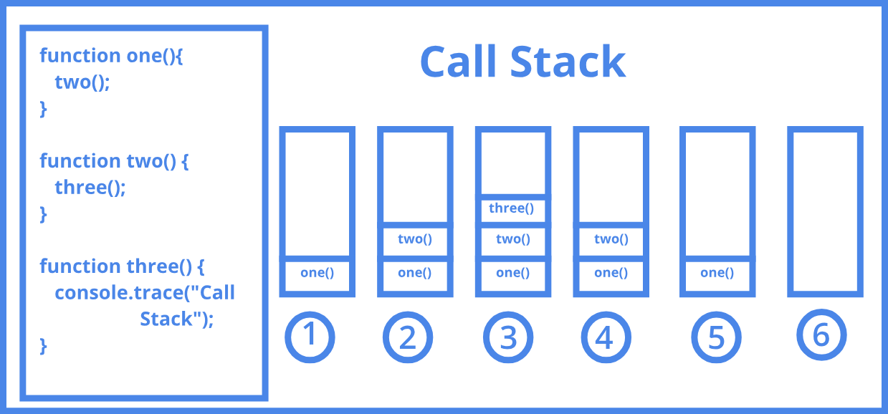

## ¿Qué es la recursividad?

<p align="justify">Definición 1: Es una forma de expresar un procedimiento en base a su propia de definición, reduciéndolo de manera recurrente a la mínima expresión.</p>

<p align="justify">Definición 2: Ejecutar una tarea o una serie de pasos repetidamente hasta que alcance algún objetivo deseado.</p>

<p align="justify">Definición 3: Es una técnica de programación que busca resolver un problema sustituyéndolo por otros problemas de la misma categoría, pero más simples.</p>

<p align="justify">Definición 4: La idea básica detrás de los algoritmos recursivos, para resolver un problema, resuelve un subproblema que sea una instancia más pequeña del mismo problema, y después usa la solución de esa instancia más pequeña para resolver el problema original.</p>

<p align="justify">En lenguaje de código, una función recursiva es una función que se llama a sí misma.</p>

<p align="center">

</p>

<p align="justify"><i>"Un problema recursivo puede dividirse en instancias más pequeñas para resolverlas individualmente de manera repetitiva hasta encontrar una solución global."</i></p>

<p align="justify">Observando a las muñecas rusas. Aunque no aparecen en ningún algoritmo, se puede ver que cada muñeca encierra a todas las muñecas mas pequeñas (de manera análoga al caso recursivo), hasta que la muñeca más pequeña no encierra a ninguna otra (como el caso base).</p>

<p align="justify">Se llama <i>caso base</i> o <i>condición de salida</i>  al caso trivial de un algoritmo recursivo, del cual conocemos su solución. El caso base contempla el caso en el cual la solución es lo suficientemente sencilla como para responder directamente sin necesidad de realizar otra llamada del algoritmo.</p>

### Ejemplos de recursividad en la vida cotidiana

<p align="center">

</p>

De la recursión se puede extraer dos reglas sencillas:

<ol>
    <li><p align="justify">Cada llamada recursiva debe ser sobre una instancia más pequeña del mismo problema, es decir, un subproblema más pequeño.</p></li>
    <li><p align="justify">Las llamadas recursivas eventualmente deben alcanzar un caso base, el cual se resuelve sin más recursividad.</p></li>
</ol>

### **Algoritmos recursivos**

<ul>
    <li><p align="justify">Algoritmos que se llaman en cascada a sí mismos para resolver un problema.</p></li>
    <li><p align="justify">Debe cuidarse que esta llamadas no sean infinitas.</p></li>
    <li><p align="justify">Deben tener una condición de salida.</p></li>
</ul>

### Ventajas:

<ul>
    <li><strong>Extensión:</strong>Algoritmos más pequeños.</li>
    <li>
    <strong>Expresión:</strong>
    <ul>
        <li>Elegante</li>
        <li>Sencillo de escribir, de leer y de analizar.</li>
    </ul>
    </li>
    <li><strong>División del problema:</strong>Subproblemas que recombinan sus soluciones.</li>
    <li><strong>Análisis y mantenimiento:</strong>Técnicas de inducción matemática.</li>
    <li>
    <strong>Ejecución:</strong>
    <ul>
        <li><p align="justify">Se delega la responsabilidad del control de sus llamadas recursivas y los valores de sus variables al sistema.</p></li>
        <li><p align="justify">En otros algoritmos, el programador debe prever estas situaciones en el diseño.</p></li>
    </ul>
    </li>
</ul>

### Desventajas:

<ul>
    <li><strong>Eficiencia:</strong>Menos eficientes.</li>
    <li>
    <strong>Costo computacional:</strong>
    <ul>
        <li><strong>Velocidad</strong> - Más lentos</li>
        <li><strong>Sobrecarga</strong> - Demasiadas llamadas recursivas</li>
        <li><strong>Memoria</strong> - Ocupan más memoria</li>
    </ul>
    </li>
</ul>

### Ejemplo típico de recursividad

<p align="justify">Es el de una función para calcular el factorial de un número. El factorial de un número es el resultado de multiplicar dicho número por todos los precedentes, hasta llegar a 1.</p>

<p align="justify">Por ejemplo, factorial(3) = 3 * 2 * 1. Si observamos que el factorial de un número es equivalente al producto de dicho número por el factorial del número precedente:</p>

<p align="center">factorial(3) = 3 * factorial (2)</p>

podemos plantear una implementación recursiva:

```code
función factorial(n)
    si n = 1
        devolver 1
    sino
        devolver n * factorial (n-1)
    fin si
fin funcion
```

En este caso, la sentencia

<p align="center">si n = 1 devolver 1</p>

<p align="justify">Es la <i>condición de salida</i> o <i>caso base</i> que evita que la función se llame a sí misma indefinidamente.</p>

### OJO

<p align="justify"><strong>Todo algoritmo recursivo debe incluir al menos un caso base y garantizar que se ejecuta en algún momento para evitar la recursividad infinita.</strong></p>

### NOTA

<p align="justify"><strong>La mayoría de los algoritmos que pueden ser descritos de forma <i>iterativa</i> (es decir, haciendo uso de bucles <i>while, for</i>...) pueden ser reescritos de forma <i>recursiva</i>, y viceversa.</strong></p>

<p align="justify">Se pueden establecer diferentes categorías de recursividad en virtud de la característica del algoritmo analizada:</p>

<ul>
    <li><p align="justify">Según el punto desde el cual se hace la llamada recursiva: <strong>recursividad directa o indirecta.</strong></p></li>
    <li><p align="justify">Según el número de llamadas recursivas efectuadas en tiempo de ejecución: <strong>recursividad lineal o no lineal.</strong></p></li>
    <li><p align="justify">Según el punto del algoritmo desde donde se efectúa la llamada recursiva: <strong>recursividad final o no final.</strong></p></li>
</ul>

Antes de seguir avanzando, exploremos la programación funcional:

<p align="justify">Como su nombre lo indica, está centrada en funciones, las cuales son tratadas como ciudadanos de primera clase. En este esquema, lafunción siempre representará la relación entre una entrada y una salida, tal como en matemáticas, en las que tienes que si a una funciónintroduces un valor X, obtendrás como resultado un valor Y.</p>

<p align="center">
 
</p>

### Invocación de función:

<p align="justify">Cuando llamamos a una función, se coloca un contexto de ejecución en la pila de ejecución. Analicemos esto un poco más.</p>

Primero, ¿qué es una pila?

<p align="justify">Una pila es una estructura de datos que opera sobre la base de "Último en entrar, primero en salir". Un elemento se "empuja" a una pila para agregarlo, y un elemento se "saca" de la pila para eliminarlo.</p>

<p align="center">
 
</p>

<p align="justify">El uso de una pila es un método para ordenar ciertas operaciones para su ejecución.</p>

<p align="justify">Ahora, volviendo a ¿qué es un contexto de ejecución? Un contexto de ejecución se forma tras la invocación de una función. Este contexto se sitúa en una pila de ejecución, un orden de operaciones. El elemento que siempre está primero en esta pila es el contexto de ejecución global. Lo siguiente son los contextos creados por cualquier función.</p>

<p align="center">
 
</p>

<p align="justify">Estos contextos de ejecución tienen propiedades, un objeto de activación y un enlace "este". El enlace "este" es una referencia a este contexto de ejecución. El objeto de activación incluye: parámetros pasados, variables declaradas y declaraciones de funciones.</p>

<p align="justify">Entonces, cada vez que colocamos un nuevo contexto en la pila, generalmente tenemos todo lo que necesitamos para ejecutar el código.</p>

¿Por qué se dice que habitualmente ?

<p align="justify">Con la recursividad, se esta esperando valores de retorno provenientes de otros contextos de ejecución. Estos otros contextos están más arriba en la pila. Cuando el último elemento de la pila termina de ejecutarse, ese contexto genera un valor de retorno. Este valor de retorno se transmite como valor de retorno del caso recursivo al siguiente elemento. Ese contexto de ejecución luego se saca de la pila.</p>

<i>Ejemplo de valores de retorno:</i>

<p align="center">
 
</p>

## Ejemplos de recursividad(En Java):

<h3><u>Imprimir numeros de forma descendente:</u></h3>

<p align="justify">Implementación de un método recursivo que reciba un parámetro de tipo entero y luego llame en forma recursiva con el valor del parámetro menos 1.</p>

**Implementación**

### Función imprimir:

```java
public static void imprimirV(int v[]){
    for(int i = 0; i < v.length; i++){
        System.out.print(v[i]+" ");
    }
    System.out.println("\n");
}
```

<br/>

Llamada al método desde la clase principal:

```java
public class Main {
    public static void main(String[] args) throws Exception {
        imprimir(5);
}
```

<br/>

**Salida en consola:**

```java
5
4
3
2
1
```

<br />

<h3><u>Factorial:</u></h3>

<p align="justify">Programar un algoritmo recursivo que calcule el factorial de un número.</p>

**Implementación**

### Función factorial (Forma 1):

```java
public static int factorial(int n){
    if(n==0) return 1; //AXIOMA
    else return n*factorial(n-1); //FORMULA RECURSIVA
}
```

<br/>

### Función factorial (Forma 2):

```java
public static int fact(int fac){
    if(fac > 0){
        int valor = fac * fact(fac - 1);
        return valor;
    }else{
        return 1;
    }
}
```

<br/>

Llamada al método desde la clase principal:

```java
public class Main {
    public static void main(String[] args) throws Exception {
        System.out.println(factorial(5));
        System.out.println(fact(4));
}
```

<br/>

**Salida en consola:**

```java
120
24
```

<br />

<h3><u>Fibonacci:</u></h3>

<p align="justify">Programar un algoritmo recursivo que calcule un número de la serie fibonacci.</p>

**Implementación**

### Función fibonacci:

```java
public static int fibonaci(int n){
    if(n==1 || n==2) return 1;
    else return fibonaci(n-1)+fibonaci(n-2);
}
```

<br/>

Llamada al método desde la clase principal:

```java
public class Main {
    public static void main(String[] args) throws Exception {
        System.out.println(fibonaci(20));
}
```

<br/>

**Salida en consola:**

```java
6765
```

<br />

<h3><u>Division de un número:</u></h3>

<p align="justify">Programar un algoritmo recursivo que permita hacer la división por restas
sucesivas.</p>

**Implementación**

### Función division:

```java
public static int division(int a, int b) {
    if (b>a) return 0;
    else return division(a-b,b)+1;
}
```

<br/>

Llamada al método desde la clase principal:

```java
public class Main {
    public static void main(String[] args) throws Exception {
        System.out.println(division(20,5));
}
```

<br/>

**Salida en consola:**

```java
4
```

<br />


<h3><u>Invertir un número:</u></h3>

<p align="justify">Programar un algoritmo recursivo que permita invertir un número. <strong>Ejemplo:
Entrada: 123 Salida: 321</strong></p>

**Implementación**

### Función invertir:

```java
public static String invertir(int a){
    if(a == 0){
        return "";
    }else{
        return ((a%10)+invertir(a/10));
    }
}
```

<br/>

Llamada al método desde la clase principal:

```java
public class Main {
    public static void main(String[] args) throws Exception {
        System.out.println(invertir(123456789));
}
```

<br/>

**Salida en consola:**

```java
987654321
```

<br />

<h3><u>Sumar digitos de un número:</u></h3>

<p align="justify">Programar un algoritmo recursivo que permita sumar los dígitos de un
número. <strong>Ejemplo: Entrada: 123 Resultado:6</strong></p>

**Implementación**

### Función sumar_dig:

```java
public static int sumar_dig(int n){
    if(n == 0){
        return n;
    }else{
        return sumar_dig(n/10)+ (n % 10);
    }
}
```

<br/>

Llamada al método desde la clase principal:

```java
public class Main {
    public static void main(String[] args) throws Exception {
        System.out.println(sumar_dig(123456789));
}
```

<br/>

**Salida en consola:**

```java
45
```

<br />

<h3><u>Sumar números de un vector recursivamente:</u></h3>

<p align="justify">Programar un algoritmo recursivo que permita sumar los elementos de un
vector.</p>

**Implementación**

### Función suma_vec:

```java
public static int suma_vec(int v[], int n){
    if(n == 0) return v[n];
    else return suma_vec(v, n-1) + v[n];
}
```

<br/>

Llamada al método desde la clase principal:

```java
public class Main {
    public static void main(String[] args) throws Exception {
        int[] numbers = {10,15,20,25,30,35,40,45,50,55,60};
        System.out.println(suma_vec(numbers,numbers.length-1));
}
```

<br/>

**Salida en consola:**

```java
385
```

<br />

<h3><u>Multiplicar números de un vector recursivamente:</u></h3>

<p align="justify">Programar un algoritmo recursivo que permita multiplicar los elementos de un
vector.</p>

**Implementación**

### Función multiplicar:

```java
public static int multiplicar(int vec[], int tam){
    if(tam == 0) return vec[0];
    return (vec[tam] * multiplicar(vec, tam-1));
}
```

<br/>

Llamada al método desde la clase principal:

```java
public class Main {
    public static void main(String[] args) throws Exception {
        int[] numbers2 = {9,2,8,6,5,3,7,1,4};
        System.out.println(multiplicar(numbers2,numbers2.length-1));
}
```

<br/>

**Salida en consola:**

```java
362880
```

<br />

<h3><u>Imprimir un vector recursivamente:</u></h3>

<p align="justify">Programar un algoritmo recursivo que permita mostrar los elementos de un
vector.</p>

**Implementación**

### Función recorrido:

```java
public static void recorrido(int[] array, int indice){
    if (indice != array.length){
        //Mostramos el valor en ese indice
        System.out.print(array[indice]);
        //Llamamos recursivamente a la función
        recorrido(array, indice+1);
    }
    System.out.print("");
}
```

<br/>

Llamada al método desde la clase principal:

```java
public class Main {
    public static void main(String[] args) throws Exception {
        int[] numbers2 = {9,2,8,6,5,3,7,1,4};
        recorrido(numbers2, 0);
}
```

<br/>

**Salida en consola:**

```java
9 2 8 6 5 3 7 1 4
```

<br />

<h3><u>Ordenar un vector recursivamente:</u></h3>

<p align="justify">Programar un algoritmo recursivo que permita ordenar los elementos de un
vector.</p>

**Implementación**

### Función ordenar:

```java
public static void ordenar(int v[], int cant){
    if(cant > 1){
        for(int f = 0; f < cant - 1 ; f++){
            if(v[f] > v[f+1]){
                int aux = v[f];
                v[f] = v [f+1];
                v[f+1] = aux;
            }
            ordenar(v, cant - 1);
        }
    }
}
```

<br/>

Llamada al método desde la clase principal:

```java
public class Main {
    public static void main(String[] args) throws Exception {
        int[] numbers2 = {9,2,8,6,5,3,7,1,4};
        recorrido(numbers2, 0);
        ordenar(numbers2,numbers2.length);
        System.out.println("-----------------")
        recorrido(numbers2, 0);
}
```

<br/>

**Salida en consola:**

```java
9 2 8 6 5 3 7 1 4 
-----------------
1 2 3 4 5 6 7 8 9 
```

<br />

<h3><u>Buscar un vector recursivamente:</u></h3>

<p align="justify">Programar un algoritmo recursivo que permita buscar un elemento en los elementos de un
vector.</p>

**Implementación**

### Función buscarElemento:

```java
public static int buscarElemento(int[] array, int elementoBuscar ,int indice){
         
    if(indice==array.length || array[indice]==elementoBuscar){
            
        if(indice==array.length){
            return -1; 
        }else{
            return indice;
        }
            
    }else{
        return buscarElemento(array, elementoBuscar, indice+1);
    }
        
}
```

<br/>

Llamada al método desde la clase principal:

```java
public class Main {
    public static void main(String[] args) throws Exception {
        int[] numbers2 = {9,2,8,6,5,3,7,1,4};
        int elementoBuscar = 3;
        int posElementoEncontrado = buscarElemento(numbers2, elementoBuscar,0);
        System.out.println("El elemento encontrado fue: " + numbers2[posElementoEncontrado]);
}
```

<br/>

**Salida en consola:**

```code
El elemento encontrado fue: 3
```

<br />

<p align="justify">Visto ya el tema de recursividad, se procede a estudiar los <a href="./arboles.md">arboles</a></p>


<!-- 
import java.util.*;

public class Main {
    public static void main(String[] args) throws Exception {
        // Your code here!
        
        System.out.println(factorial(5));
        System.out.println(fibonaci(20));
        System.out.println(division(20,5));
        System.out.println(invertir(123456789));
        System.out.println(sumar_dig(123456789));
        
        int[] numbers = {10,15,20,25,30,35,40,45,50,55,60};
        int[] numbers2 = {9,2,8,6,5,3,7,1,4};
        System.out.println(suma_vec(numbers,numbers.length-1));
        System.out.println(multiplicar(numbers2,numbers2.length-1));
        imprimir(5);
        imprimirV(numbers2);
        ordenar(numbers2,numbers2.length);
        imprimirV(numbers2);
        System.out.println(fact(4));
        recorrido(numbers2, 0);
        int elementoBuscar = 3;
        int posElementoEncontrado = buscarElemento(numbers2, elementoBuscar,0);
        System.out.println("El elemento encontrado fue: " + numbers2[posElementoEncontrado]);
        
    }
    
    public static int factorial(int n){
        if(n==0) return 1; //AXIOMA
        else return n*factorial(n-1); //FORMULA RECURSIVA
    }
    
    public static int fibonaci(int n){
        if(n==1 || n==2) return 1;
        else return fibonaci(n-1)+fibonaci(n-2);
    }
    
    public static int division(int a, int b) {
        if (b>a) return 0;
        else return division(a-b,b)+1;
    }
    
    public static String invertir(int a){
        if(a == 0){
            return "";
        }else{
            return ((a%10)+invertir(a/10));
        }
    }
    
    public static int sumar_dig(int n){
        if(n == 0){
            return n;
        }else{
            return sumar_dig(n/10)+ (n % 10);
        }
    }

    public static int suma_vec(int v[], int n){
        if(n == 0) return v[n];
        else return suma_vec(v, n-1) + v[n];
    }
    
    public static int multiplicar(int vec[], int tam){
        if(tam == 0) return vec[0];
        return (vec[tam] * multiplicar(vec, tam-1));
    }
    
    public static void imprimir(int x){
        if( x > 0) {
            System.out.println(x);
            imprimir(x-1);
        }
    }
    
    public static void ordenar(int v[], int cant){
        if(cant > 1){
            for(int f = 0; f < cant - 1 ; f++){
                if(v[f] > v[f+1]){
                    int aux = v[f];
                    v[f] = v [f+1];
                    v[f+1] = aux;
                }
                ordenar(v, cant - 1);
            }
        }
    }
    
    public static void imprimirV(int v[]){
        for(int i = 0; i < v.length; i++){
            System.out.print(v[i]+" ");
        }
        System.out.println("\n");
    }
    
    public static int fact(int fac){
        if(fac > 0){
            int valor = fac * fact(fac - 1);
            return valor;
        }else{
            return 1;
        }
    }
    
    public static void recorrido(int[] array, int indice){
        if (indice != array.length){
            //Mostramos el valor en ese indice
            System.out.println(array[indice]);
            //Llamamos recursivamente a la función
            recorrido(array, indice+1);
        }
    }
    
    public static int buscarElemento(int[] array, int elementoBuscar ,int indice){
         
       if(indice==array.length || array[indice]==elementoBuscar){
             
            if(indice==array.length){
               return -1; 
            }else{
                return indice;
            }
             
        }else{
            return buscarElemento(array, elementoBuscar, indice+1);
        }
         
    }
}

 -->